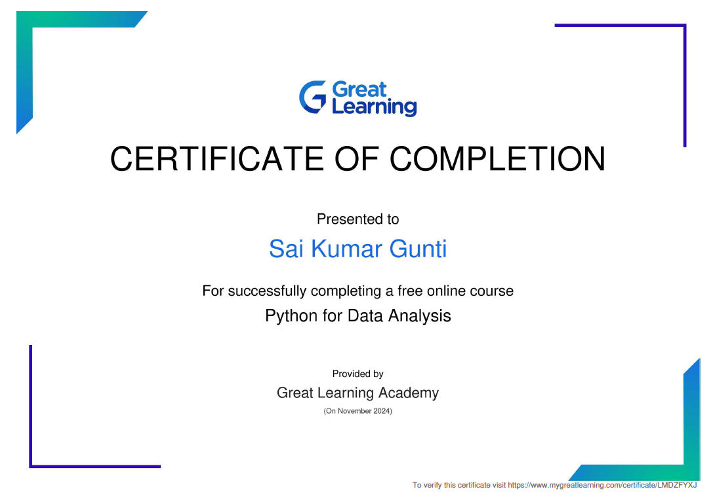
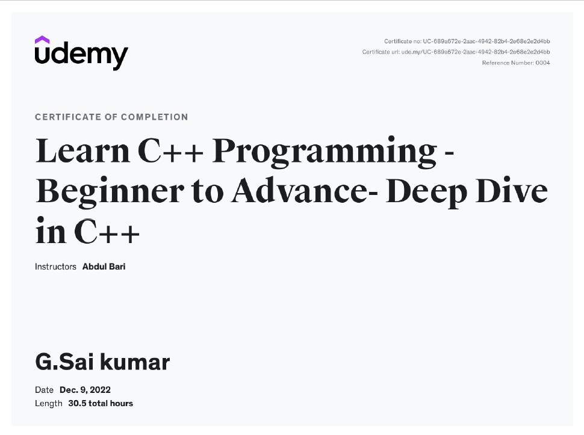
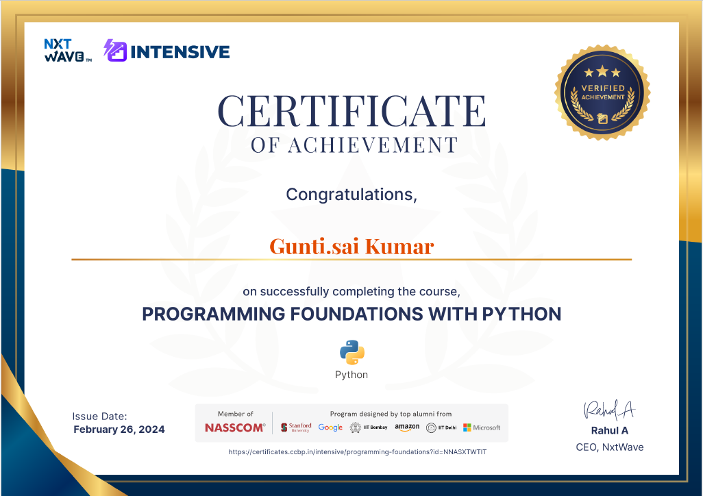
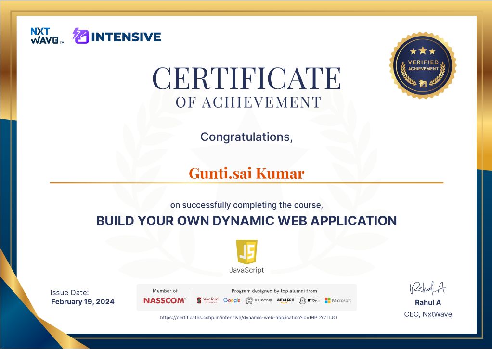
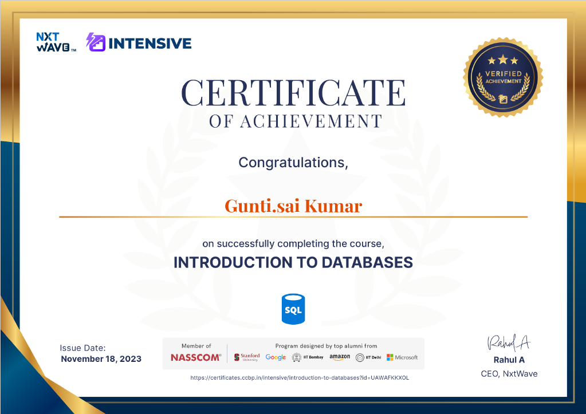
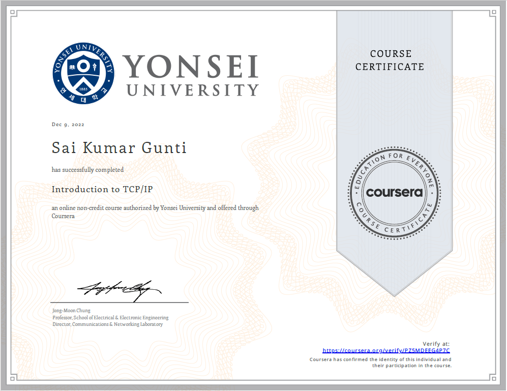

# Certificates

##PythonfordataAnalysis

##AWS

##C++

##Python

##HTML,CSS,Bootstrap

##Bootstrapflexbox

##Javascript

##Javaessentials

##SQL

##Flexbox

##GIThubandCommandline

##Softwaredevelpment

##Networking TCP/IP

